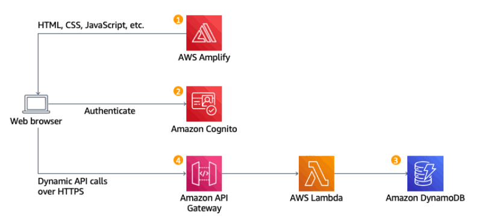

# CloudStock

CloudStock is an AWS serverless inventory management application.

## Architecture

## Detailed Implementation Phases

### Phase 1: Data & Security Setup
This phase establishes the database tier and implements secure IAM access following the principle of least privilege.
* **Amazon DynamoDB**:
  * **Table Name**: `cloudstock-inventory`
  * **Billing Mode**: On-Demand (`PAY_PER_REQUEST`) for automatic scaling.
  * **Partition Key**: `sku` (String).
* **IAM Security Scoping**:
  * **Custom Policy**: `cloudstock-lambda-dynamo-policy`
  * **Granted Actions**: `dynamodb:Scan`, `dynamodb:GetItem`, `dynamodb:PutItem`, and `dynamodb:UpdateItem`.
  * Scoped strictly to the `cloudstock-inventory` table ARN.
* **CloudWatch Logging**:
  * Granted permissions for log stream creation and event insertion (`logs:CreateLogGroup`, `logs:CreateLogStream`, `logs:PutLogEvents`).
* **Execution Role**:
  * **Role Name**: `cloudstock-lambda-role` configured with an AWS Lambda trust policy.

### Phase 2: Authentication Infrastructure
Implemented secure user authentication and access management.
* **Cognito User Pool**:
  * **Pool Name**: `cloudstock-user-pool`
  * **Configuration**: Email-based sign-in, default password policy, non-MFA for prototyping.
* **App Client**:
  * **Client Name**: `cloudstock-react-client`
  * **Configuration**: Public client without client secret (Single Page Application compatible).
* **User Management**:
  * Created and verified a warehouse manager account (`manager@cloudstock.com`).

### Phase 3: Serverless Compute Layer
Implemented business logic microservices using AWS Lambda and Node.js.
* **Get Inventory Function (`cloudstock-get-inventory`)**:
  * Reads inventory data from DynamoDB using AWS SDK v3 `ScanCommand`.
  * Formats response payloads and handles CORS headers.
* **Update Stock Function (`cloudstock-update-stock`)**:
  * Modifies inventory quantities atomically: `SET quantity = quantity + :val`.
  * Prevents write race conditions across simultaneous user updates.
  * Evaluates low-stock rules and returns `{"lowStockAlert": true}` if remaining units drop below 5.

### Phase 4: API Gateway & Security Wiring
Connected backend microservices through API Gateway and secured write operations.
* **HTTP API (`cloudstock-api`)**:
  * `GET /inventory` &rarr; Integrated with `cloudstock-get-inventory`
  * `POST /inventory/update` &rarr; Integrated with `cloudstock-update-stock`
* **CORS Configuration**:
  * Configured explicitly for cross-origin browser requests (`Access-Control-Allow-Origin: *`).
* **JWT Authorization**:
  * Attached an API Gateway JWT Authorizer (`cloudstock-cognito-authorizer`) to `POST /inventory/update`.
  * Intercepts unauthenticated write requests and responds with `401 Unauthorized` before triggering compute resources.

### Phase 5: Frontend Development
Built an interactive single-page application dashboard using React and Tailwind CSS.
* **UI Components**: Built reusable components including Navigation Bar, Stock Chart, Inventory Table, Manager Sign-In Form, and Flashing Alert Banner.
* **Analytics**: Embedded Recharts bar graphs mapping item stock levels visually.

### Phase 6: Full-Stack Integration
Connected the React client to the live AWS cloud backend.
* **AWS Amplify Auth**: Configured `@aws-amplify/auth` globally to communicate directly with Cognito.
* **Authenticated API Requests**: Configured Axios to attach the Cognito ID token dynamically: `Authorization: Bearer <JWT_TOKEN>`.
* **Dynamic Low-Stock Warnings**: Dashboard reads response flags and automatically mounts real-time alert banners.

### Phase 7: Static Website Hosting & Launch
Deployed the production application globally using Amazon S3.
* **Production Build**: Generated minified build artifacts via `npm run build`.
* **Amazon S3 Provisioning**: Created public bucket `cloudstock-web-<unique-id>` configured for Static Website Hosting.
* **SPA Routing Support**: Configured `index.html` as both Index and Error documents.
* **Access Policy**: Applied a public `s3:GetObject` bucket policy to allow global browser access.

### 🔥Key Features
*🔒 Secure JWT Authentication: Role-based access managed via Amazon Cognito User Pools and JWT-validated API endpoints.
*⚡ Decoupled Serverless Infrastructure: High-throughput, low-latency execution with 0% idle compute cost using AWS Lambda, API Gateway, and DynamoDB.
*💥 Atomic Stock Operations: Prevents race conditions during concurrent warehouse updates using DynamoDB UpdateExpression atomic counters.
*🚨 Automated Low-Stock Alerts: Real-time backend rule engine evaluates stock thresholds ($< 5$ units) and triggers animated UI alerts.
*📊 Visual Analytics Dashboard: Real-time inventory distribution charts powered by Recharts.
*🛡️ Least-Privilege IAM Security: Strictly scoped execution policies protecting resources at the ARN level.
